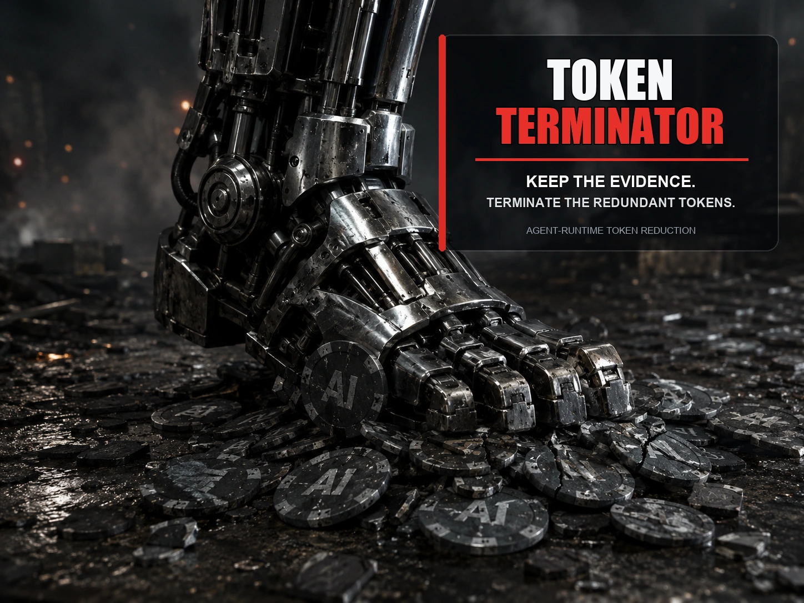
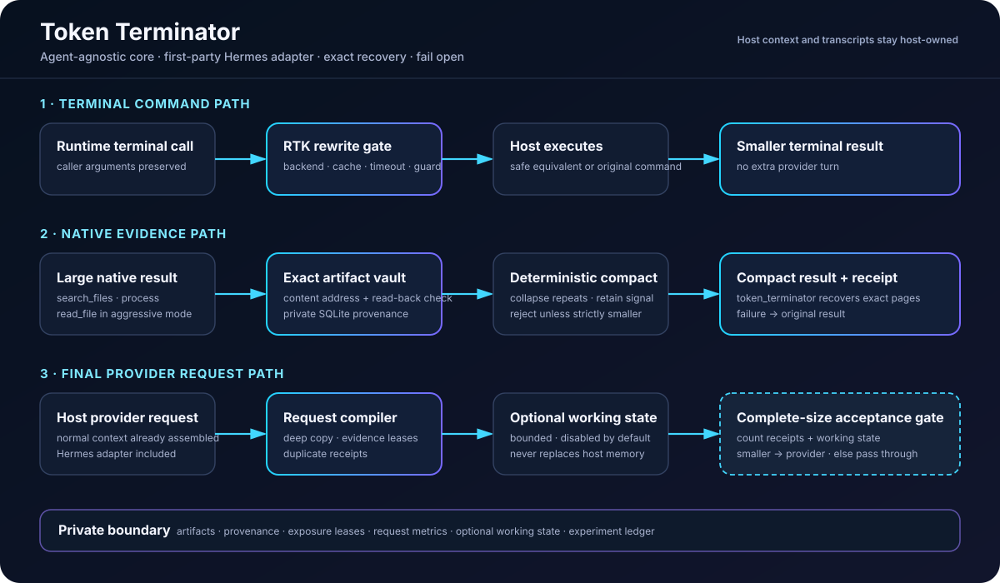

<p align="center">
  
</p>

<h1 align="center">Token Terminator</h1>

<p align="center">
  <strong>Keep the evidence. Terminate the redundant tokens.</strong><br>
  Portable token reduction for agent runtimes, with a first-party
  <a href="https://github.com/NousResearch/hermes-agent">Hermes Agent</a> adapter.
</p>

<p align="center">
  <a href="https://github.com/AronAxe/Token-Terminator/actions/workflows/ci.yml"></a>
  
  <a href="LICENSE"></a>
  
  
</p>

Token Terminator is an agent-runtime optimization layer. It removes token bloat at the tool-result and provider-request boundaries without discarding the underlying evidence.

The engine has four cooperating reduction paths:

1. transparent terminal-command rewriting through [RTK](https://github.com/rtk-ai/rtk);
2. deterministic compression of large tool results;
3. content-addressed vaulting, duplicate collapse, evidence leases, and compact recovery receipts;
4. final provider-request compilation, with optional bounded working-state injection only when the complete request is still smaller.

The reduction core is not intrinsically tied to Hermes: it operates on Python dictionaries, strings, stable request/session identifiers, and a local SQLite vault. The repository includes a turnkey Hermes plugin because Hermes exposes the required lifecycle hooks. Other agent runtimes need a small adapter that presents the same boundaries; they do not need a fork of the reduction engine.

It does **not** replace the host's context engine, memory system, transcript store, or provider client. It does not add an MCP server or standing prompt text. If storage, recovery, middleware, or compilation is unavailable or unsafe, the host receives the original request or result unchanged.

## What it does

- **Shrinks before the model sees it.** Large tool output is compacted and repeated evidence is replaced with bounded receipts.
- **Keeps the original evidence.** Exact content is stored in a private, content-addressed SQLite vault and can be recovered by page or search.
- **Compiles the final request.** Duplicate artifacts, expired inline exposures, and old context are reduced after the host assembles the provider payload.
- **Refuses bad optimizations.** A transformed payload is used only when it is strictly smaller, recoverable, provider-valid, and leaves caller-owned objects untouched.
- **Measures the result.** Content-free request/session telemetry separates compiler, compactor, and end-to-end savings.

## Core invariant

A provider-visible transformation is accepted only when:

- the complete transformed payload—including receipts and optional working state—is **strictly smaller**;
- the exact native content has been written to the private vault and read back successfully; and
- caller-owned request objects remain unchanged.

This is an optimizer, not a context decorator.

## Portability: core versus adapter

| Layer | Runtime dependency | Status |
|---|---|---|
| Vault, receipts, leases, native compression, request compiler, telemetry | Agent-agnostic Python | Included |
| RTK command rewriting | Optional `rtk` binary plus a terminal-tool adapter | Included |
| Hermes lifecycle hooks, slash command, and recovery model tool | Hermes Agent | First-party and turnkey |
| LangGraph, OpenAI Agents SDK, AutoGen, CrewAI, custom loops | Their tool/request hook APIs | Adapter required |

**In practical terms:** Token Terminator is agent-agnostic as an engine, not universally plug-and-play as a package. Hermes works out of the box. Another runtime must connect tool results, final provider requests, stable request/session IDs, and the recovery tool. The core behavior and storage format stay the same.

## What it reduces

| Mechanism | Scope | Exact recovery |
|---|---|:---:|
| RTK terminal rewriting | Supported `terminal` commands | RTK behavior |
| Native result compression | Large `search_files` and `process` results | ✓ |
| Aggressive structured reads | Large `read_file` results | ✓ |
| Same-request duplicate collapse | Repeated large tool artifacts | ✓ |
| Cross-request evidence leases | Previously exposed large artifacts | ✓ |
| Request compiler | Final provider request, after normal Hermes context assembly | ✓ |
| Bounded working state | Optional request-selection aid; disabled by default | n/a |
| Experiment ledger | Request/session savings and mode comparison | content-free |

The Python import package remains `rtk_hermes_plus` for source compatibility. The public distribution, Hermes plugin, CLI, slash command, model tool, environment namespace, and repository are Token Terminator.

## Architecture

<p align="center">
  
</p>

The host runtime continues to own the conversation, transcript, context-engine lifecycle, and provider dispatch. Token Terminator owns only its private data directory and adapter-visible middleware/hooks. In the included Hermes adapter these are:

- `tool_request` middleware for terminal rewrites;
- `transform_tool_result` for native compression;
- observational lifecycle and `post_tool_call` hooks;
- `llm_request` middleware for final request reduction;
- one compact `token_terminator` tool for exact artifact recovery and optional working-state operations.

## Structural benchmark

`scripts/benchmark.py` uses `o200k_base`, makes zero provider calls, and measures each mechanism's complete provider-visible payload. The terminal case executes the real RTK rewrite and compact-result path in a disposable Git repository. This is a deterministic structural benchmark—not a claim about answer quality or causal end-to-end session cost.

| Case | Raw tokens | Output tokens | Reduction |
|---|---:|---:|---:|
| RTK terminal rewrite | 152,074 | 911 | **99.40%** |
| Native search result | 190,999 | 1,213 | **99.36%** |
| Repeated artifact, second exposure | 77,097 | 164 | **99.79%** |
| Duplicate artifact in one request | 154,116 | 77,183 | **49.92%** |
| Working-state no-bloat guard | 21 | 21 | **0%** |
| Receipt plus working-state, combined | 77,097 | 257 | **99.67%** |
| Small request pass-through | 17 | 17 | **0%** |
| **Aggregate** | **651,421** | **79,766** | **87.76%** |

Small results are intentionally untouched. Ordinary sessions will not resemble these deliberately pathological fixtures; use the experiment ledger for representative session comparisons.

## Modes

| Mode | Terminal rewrite | Native search/process | Native `read_file` | Request compiler |
|---|:---:|:---:|:---:|:---:|
| `balanced` **default** | ✓ | ✓ | — | ✓ |
| `aggressive` | ✓ | ✓ | ✓ | ✓ |
| `native` | — | ✓ | — | — |
| `terminal` | ✓ | — | — | — |
| `suggest` | Measure only | — | — | — |
| `off` | — | — | — | — |

The optional working-state block defaults to zero characters, even in `balanced` and `aggressive` modes.

## Install: Hermes Agent (turnkey)

Token Terminator 0.3.1 replaces `rtk-hermes-plus` 0.2.0. The two distributions must not coexist because both own the `rtk_hermes_plus` Python import package.

This is the supported zero-glue installation: the repository already contains the Hermes hooks, slash command, recovery tool, and lifecycle accounting. The commands below pin the immutable `0.3.1` merge commit because this repository does not yet publish release tags.

### 1. Install RTK when using terminal rewriting

```bash
brew install rtk
# Or use an installer from https://github.com/rtk-ai/rtk
```

RTK is not required for `native` mode.

### 2. Replace the old distribution in Hermes' environment

Disable the old plugin before replacing its package. A first-time installation may simply report that `rtk-plus` is not enabled.

POSIX example:

```bash
HERMES_PY="$HOME/.hermes/hermes-agent/venv/bin/python"
hermes plugins disable rtk-plus
"$HERMES_PY" -m pip uninstall -y rtk-hermes-plus token-terminator
"$HERMES_PY" -m pip install \
  'git+https://github.com/AronAxe/Token-Terminator.git@e02a035d52cc2b0e6e95748b35deb1f61656a4a3'
```

Windows example:

```powershell
$HermesPy = "$env:LOCALAPPDATA\hermes\hermes-agent\venv\Scripts\python.exe"
hermes plugins disable rtk-plus
& $HermesPy -m pip uninstall -y rtk-hermes-plus token-terminator
& $HermesPy -m pip install "git+https://github.com/AronAxe/Token-Terminator.git@e02a035d52cc2b0e6e95748b35deb1f61656a4a3"
```

### 3. Enable one plugin

```bash
hermes plugins enable token-terminator --no-allow-tool-override
```

Do not enable a second RTK rewrite adapter alongside Token Terminator.

After commencing a new Hermes session:

```text
/token-terminator status
```

Installation and enablement are separate operations. Disabling affects subsequent sessions; it does not delete private vault data. See [MIGRATION.md](MIGRATION.md) for the reviewed 0.2.0 replacement and rollback procedure.

## Install: another agent runtime (adapter API)

Install the same distribution in the environment that owns your agent loop:

```bash
python -m pip install \
  'git+https://github.com/AronAxe/Token-Terminator.git@e02a035d52cc2b0e6e95748b35deb1f61656a4a3'
```

Then connect your runtime's tool-result and final-request hooks to `Runtime`. The adapter must map equivalent tools to Token Terminator's canonical names (`search_files`, `process`, and optionally `read_file`) and expose `Runtime.tool` to the model for exact recovery.

```python
from pathlib import Path

from rtk_hermes_plus.config import Config
from rtk_hermes_plus.plugin import Runtime

terminator = Runtime(
    Config(
        mode="balanced",
        db_path=Path(".token-terminator/artifacts.sqlite3"),
        ledger_enabled=False,
    ),
    profile_name="my-agent",
)


def reduce_tool_result(name, arguments, result, *, session_id, call_id):
    try:
        reduced = terminator.transform_tool_result(
            tool_name=name,
            args=arguments,
            result=result,
            session_id=session_id,
            tool_call_id=call_id,
        )
    except Exception:
        return result
    return reduced if reduced is not None else result


def reduce_provider_request(request, *, session_id, request_id):
    try:
        decision = terminator.llm_request_middleware(
            request=request,
            session_id=session_id,
            request_id=request_id,
        )
    except Exception:
        return request
    return decision["request"] if decision is not None else request
```

An adapter must preserve four contracts: stable request/session identity, original-object immutability, pass-through on `None` or error, and model access to `artifact_get`. The `Runtime` surface is usable today; framework-specific one-command adapters beyond Hermes are not yet shipped.

## Exact recovery

Compressed results and request receipts contain an artifact identifier. The model can recover an exact page through the registered tool:

```json
{
  "action": "artifact_get",
  "artifact_id": "a_<content-address>",
  "offset": 0,
  "limit": 8000
}
```

Supported actions are:

- `artifact_get` — page exact content;
- `artifact_search` — locate private artifacts by content or tool name;
- `status` — inspect bounded plugin state;
- `working_state_apply` and `working_state_get` — control the optional bounded working-state selector.

Artifact text and tool arguments stay in the plugin-owned SQLite vault. Receipts expose only a bounded tool label, character count, artifact ID, and abbreviated digest.

## Configuration

All plugin-owned files default under `<HERMES_HOME>/token-terminator/`.

| Variable | Default | Purpose |
|---|---|---|
| `TOKEN_TERMINATOR_ENABLED` | `true` | Master plugin behavior gate |
| `TOKEN_TERMINATOR_MODE` | `balanced` | Select one mode from the table above |
| `TOKEN_TERMINATOR_TIMEOUT_MS` | `500` | RTK helper deadline |
| `TOKEN_TERMINATOR_BACKENDS` | `local` | Allowed terminal backends, comma-separated, or `all` |
| `TOKEN_TERMINATOR_CACHE_TTL` | `600` | Rewrite-cache lifetime in seconds |
| `TOKEN_TERMINATOR_CACHE_SIZE` | `512` | Maximum exact-command decisions retained |
| `TOKEN_TERMINATOR_NATIVE_MIN_CHARS` | `12000` | Leave smaller native results unchanged |
| `TOKEN_TERMINATOR_NATIVE_MAX_CHARS` | `8000` | Native compact-text target |
| `TOKEN_TERMINATOR_DB_PATH` | `token-terminator/artifacts.sqlite3` | Vault, leases, working state, and request metrics |
| `TOKEN_TERMINATOR_MIN_ARTIFACT_CHARS` | `8000` | Minimum request artifact size |
| `TOKEN_TERMINATOR_MAX_ARTIFACT_CHARS` | `2000000` | Per-artifact character ceiling |
| `TOKEN_TERMINATOR_VAULT_MAX_BYTES` | `536870912` | Total exact-content capacity |
| `TOKEN_TERMINATOR_INLINE_LEASES` | `1` | Full provider exposures per session/artifact |
| `TOKEN_TERMINATOR_MAX_PAGE_CHARS` | `20000` | Hard artifact-read page ceiling |
| `TOKEN_TERMINATOR_MAX_SEARCH_RESULTS` | `50` | Hard artifact-search result ceiling |
| `TOKEN_TERMINATOR_WORKING_GRAPH_CHARS` | `0` | Optional bounded working-state block; `0` disables it |
| `TOKEN_TERMINATOR_LEDGER` | `true` | Persist content-free experiment accounting |
| `TOKEN_TERMINATOR_LEDGER_PATH` | `token-terminator/experiments.sqlite3` | Experiment ledger |
| `TOKEN_TERMINATOR_STATE_DB` | Hermes `state.db` | Canonical Hermes accounting source |
| `TOKEN_TERMINATOR_EXPERIMENT` | `default` | Comparison namespace |
| `TOKEN_TERMINATOR_EXCLUDE` | empty | Terminal command prefixes never rewritten |
| `TOKEN_TERMINATOR_PYTEST_GUARD` | `true` | Avoid RTK's pytest double-quiet edge case |

The `TOKEN_TERMINATOR_EQ_*` variables optionally attach a labelled API-equivalent rate card. Actual OAuth/subscription marginal cost remains distinct. Legacy `RTK_HERMES_PLUS_*` aliases are accepted for one migration release, but the new namespace takes precedence.

## Metrics and experiments

Inside Hermes:

```text
/token-terminator status
/token-terminator stats
/token-terminator compare
/token-terminator compare native balanced
/token-terminator reset-stats
```

The process-local metrics contain bounded counters and character totals. Durable request metrics separate compiler-stage savings (`raw_chars - compiled_chars`), context-compactor savings (`compiled_chars - final_chars`), and measured end-to-end savings (`raw_chars - final_chars`). Compiler-only rows are reported separately from requests whose final provider payload was observed. These columns are an additive schema-2 extension so a rollback to the original 0.3.0 package can still open and write the database. If that legacy writer updates a measured identity, a database trigger clears the newer fields so status reports the row as unmeasured rather than retaining stale end-to-end telemetry.

The durable experiment ledger stores session/turn identifiers, mode/model labels, token/cost totals, transformation counts, and salted local prompt fingerprints. It does not store command strings, prompts, or tool contents.

A valid comparison requires separate fresh sessions with stable modes, the same model/settings, and representative repeated tasks. Mode/model changes contaminate a session and exclude it rather than manufacturing a persuasive number.

## Security and privacy

- Exact raw artifacts and their private provenance are stored locally because recovery is part of the product contract.
- The vault enforces per-artifact and total-capacity limits, SQLite foreign keys, busy timeouts, schema-version checks, and short-lived transactions.
- POSIX storage uses `0700` parent directories and `0600` databases. Windows storage inherits the user's profile ACLs.
- RTK subprocesses use argument arrays with `shell=False`.
- Remote terminal backends are disabled by default.
- Tool arguments and artifact contents never enter receipts, metrics, or the experiment ledger.
- Unsupported, malformed, unavailable, non-recoverable, or non-smaller transformations pass through unchanged.

See [SECURITY.md](SECURITY.md) for the reporting policy and data boundaries.

## FAQ

### Is Token Terminator only for Hermes?

No. The reduction engine and vault are ordinary Python and SQLite. Hermes is the first runtime with a complete, maintained adapter in this repository. Other runtimes need to connect their equivalent tool-result, provider-request, identity, and recovery seams.

### Is RTK required?

Only for terminal-command rewriting. Native tool-result compression, vaulting, recovery, and request compilation do not require the `rtk` binary. Use `native` mode to disable both RTK and request compilation, or a custom adapter with `balanced`/`aggressive` mode to use the broader engine.

### Does it summarize away evidence?

No. Provider-visible content may be compacted, but accepted transformations retain exact native content in the private vault and emit a recovery receipt. If write-and-read-back verification fails, the original content passes through.

### Does it replace the host's memory or context engine?

No. Token Terminator operates after or alongside normal context assembly. It does not own the transcript, alter persisted conversation history, or require a particular memory engine.

### What happens when it fails?

The optimization is skipped. Unsupported payloads, storage errors, timeouts, malformed data, non-smaller results, and adapter exceptions must all resolve to the original request or result.

## Rollback to RTK Hermes Plus 0.2.0

Disable/remove `token-terminator` from the profile first, then replace the distribution with the immutable pre-rename commit:

```bash
HERMES_PY="$HOME/.hermes/hermes-agent/venv/bin/python"
"$HERMES_PY" -m pip uninstall -y token-terminator rtk-hermes-plus
"$HERMES_PY" -m pip install \
  'git+https://github.com/AronAxe/Token-Terminator.git@2ef250cca98f691eba82e193bd8c26fd4ab652f4'
```

Re-enable only `rtk-plus` for subsequent sessions. The rollback does not require Hermes core or LCM changes and does not delete Token Terminator's private data directory.

## Development and release verification

```bash
python -m pip install -e '.[dev]'
python -m ruff check src tests scripts
python -m ruff format --check src tests scripts
python -m pytest -p no:cacheprovider
python scripts/benchmark.py
python -m build
python -m twine check dist/*
python scripts/verify_release.py 'dist/*'
```

`scripts/smoke_hermes.py` must be run from an isolated environment containing the built wheel and a compatible Hermes Agent installation. It creates a disposable `HERMES_HOME`, uses the real `PluginManager`, makes no network calls, and does not touch a live profile.

Contributions must preserve the central invariant: **strictly smaller complete provider payload, exact recovery, immutable caller requests, and fail-open host behavior.**

## Acknowledgements

Token Terminator retains and extends the original RTK integration, inspired by Vinicius Gallotti's MIT-licensed [`rtk-hermes`](https://github.com/ogallotti/rtk-hermes) adapter and built around RTK's command-rewrite protocol.

## License

[MIT](LICENSE) © 2026 Aron Bijl
