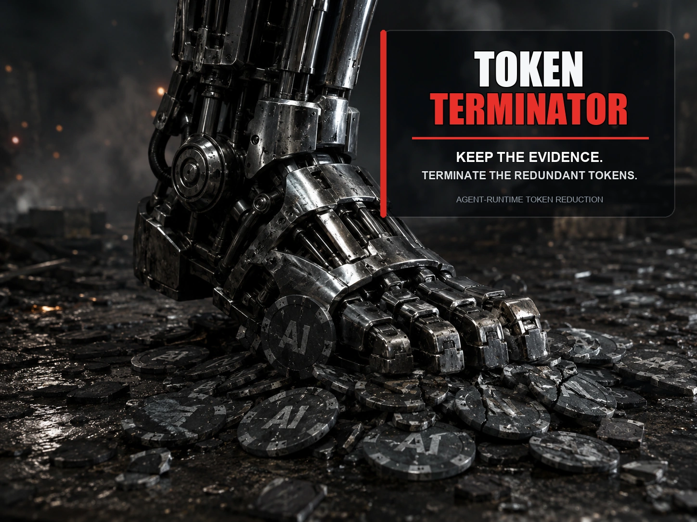
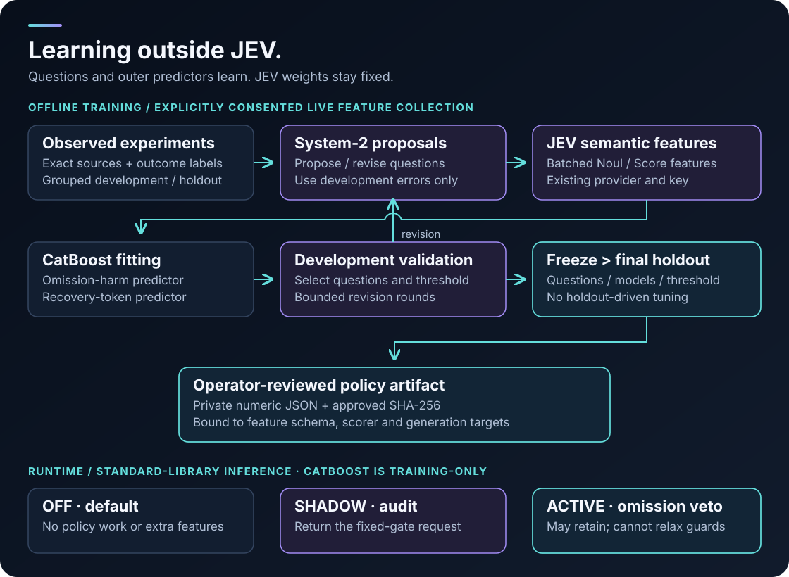
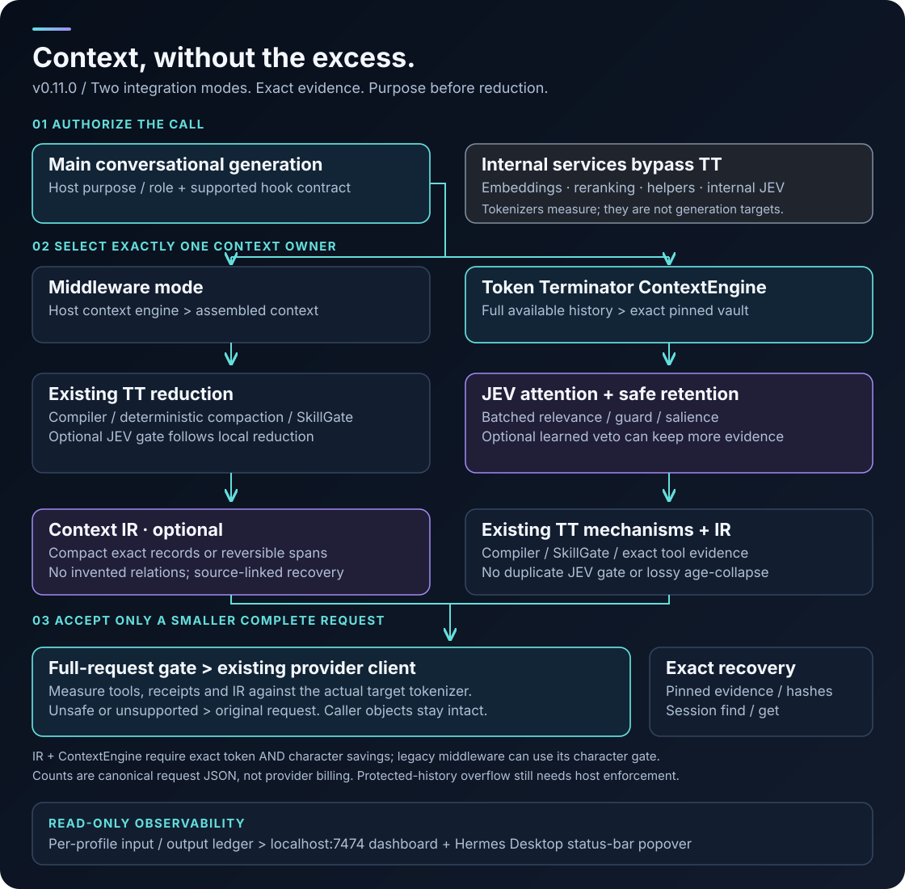

<p align="center">
  
</p>

<h1 align="center">Token Terminator</h1>

<p align="center">
  <strong>Keep the evidence. Terminate the redundant tokens.</strong><br>
  Portable token reduction for agent runtimes, with a first-party
  <a href="https://github.com/NousResearch/hermes-agent">Hermes Agent</a> adapter.
</p>

<p align="center">
  <a href="https://github.com/AronAxe/Token-Terminator/actions/workflows/ci.yml"></a>
  <a href="https://github.com/AronAxe/Token-Terminator/releases/tag/v0.11.2"></a>
  <a href="https://github.com/AronAxe/Token-Terminator/wiki/Jev-Semantic-Context-Gate" title="Optional JEV integration via OpenRouter or direct TypeSafe; off by default"></a>
  <a href="https://github.com/AronAxe/Token-Terminator/wiki"></a>
  <a href="https://crates.io/crates/token-terminator"></a>
  <a href="https://docs.rs/token-terminator"></a>
  
  <a href="LICENSE"></a>
  
  
</p>

Token Terminator is an agent-runtime optimization layer. It removes token bloat at the tool-result and provider-request boundaries without discarding the underlying evidence.

Documentation: see the [GitHub Wiki](https://github.com/AronAxe/Token-Terminator/wiki) for quick start, architecture, configuration, recovery, security, troubleshooting, migration, and release notes.

## Patch v0.11.2: GPT-6.1-Sol and multiplex startup

**GPT-6.1-Sol now reaches TT/JEV context reduction without a manual tokenizer
override.** A provider-checked local compatibility mapping fills the missing
upstream model-name entry. Exact recovery and strict token/character gates remain.

**Concurrent TT discovery is repaired during explicit `install-context-engine`.**
For the reviewed affected Hermes loader, the installer makes a narrowly scoped,
backed-up host-file change: initialization is synchronized and profile module
caches are separated. Unknown host implementations are refused, not overwritten.
`install-dashboard` alone does not apply this repair.

[Release notes](docs/releases/v0.11.2.md) · [Tokenizer validation](docs/TOKENIZER_COMPAT.md) ·
[Discovery repair and rollback](docs/HERMES_DISCOVERY.md)

## Patch v0.11.1: Hermes live-compression compatibility

Repairs the missing `_coerce_threshold_tokens_cap` adapter method and live
window/threshold invalidation. The selected TT engine now follows Hermes'
current route budget and isolates cloned engine settings. No new settings,
generative summarizer or relaxed tokenizer gate are introduced.

For managed/multiplex installs, upgrade the environment that actually imports
TT, then restart the appropriate idle backend through its normal supervisor.
This patch does not add unknown-model tokenizer mappings or fix Hermes' separate
concurrent plugin-discovery race. [Patch notes](docs/releases/v0.11.1.md) ·
[Compatibility details](docs/LIVE_COMPRESSION_COMPAT.md).

## New in v0.11.0

**Context, learning & observability.** This release includes the unshipped 0.10.0
ContextEngine milestone and the completed learned-policy and dashboard work.

| Capability | What ships | Activation |
| --- | --- | --- |
| **Selectable ContextEngine** | Full-history JEV attention with exact backing and rediscovery; replaces the selected upstream engine | Explicit Hermes engine selection |
| **Learned omission-risk policy** | System-2 question discovery + JEV features + CatBoost fitting; approved local inference may retain more evidence | `off` by default; `shadow` / `active` opt-in |
| **Observatory** | Per-bot input/output accounting at localhost:7474 and a Desktop bottom-bar counter/popover | Start server / enable Desktop component |
| **Purpose-first call isolation** | Embeddings, reranking, helpers, measurement and internal JEV bypass reduction | Main generation only |

[Release notes](docs/releases/v0.11.0.md) · [Select TT](#select-token-terminator-as-the-hermes-contextengine) ·
[Dashboard](docs/DASHBOARD.md) · [Learning](docs/LEARNED_POLICY.md) · [Migration](MIGRATION.md)

The portable middleware combines these cooperating reduction mechanisms:

1. transparent terminal-command rewriting through [RTK](https://github.com/rtk-ai/rtk);
2. temporal delta compression for repeated terminal observations, after the command has actually executed;
3. deterministic compression of large tool results;
4. content-addressed vaulting, duplicate collapse, evidence leases, compact recovery receipts, and deterministic layered recovery views;
5. runtime SkillGraph + SkillGate routing that models each installed skill as its own internal graph, follows only source-backed inter-skill relationships, and keeps only prompt-relevant skill index entries while preserving on-demand discovery;
6. final provider-request compilation, with model-aware token acceptance when an exact tokenizer is available and optional bounded working-state injection only when the complete request is still smaller;
7. an **optional Jev semantic context gate** that runs only after the normal compiler and deterministic compactor, batch-scores remaining prior plain-text dialogue against the current user request, vaults exact originals before replacement, and is accepted only when the complete request is still smaller;
8. an **optional Context IR compiler** after Jev that compacts exact tables, typed dictionaries and reversible text spans, pins source evidence, and requires a smaller complete tokenizer-measured request.

The reduction core is not intrinsically tied to Hermes: it operates on Python dictionaries, strings, stable request/session identifiers, and a local SQLite vault. The repository includes a turnkey Hermes plugin because Hermes exposes the required lifecycle hooks. Other agent runtimes need a small adapter that presents the same boundaries; they do not need a fork of the reduction engine.

Async agent frameworks can use the included `AsyncRuntime` façade. It keeps provider loops responsive by moving compiler, vault, and telemetry work to an executor, propagates task or token cancellation, and uses native cancellable subprocess paths for RTK command rewriting and aggressive reads. The same `Runtime` facade is used; generic final-request adapters must explicitly identify conversational calls as shown below.

In default middleware mode it does **not** replace the host context engine. In the explicitly selected v0.11.0 ContextEngine mode it replaces that context engine, but not the memory system, transcript store, or provider client. It does not add an MCP server or standing prompt text. If storage, recovery, middleware, token measurement, or compilation is unavailable or unsafe, the host receives the original request or result unchanged.

## Observatory: local dashboard and Desktop counter

Run **`token-terminator dashboard`** for the read-only dashboard at
**`http://localhost:7474`**: per-profile/bot input savings, prepared input,
host-reported output, a fourteen-day trend and optional model-rate valuation.
`token-terminator install-dashboard` installs the managed Hermes Desktop
**bottom status-bar counter and upward popover** without selecting a context
engine. Enable both the Python plugin and Desktop half; the server starts only
when you run the command. No Hermes core patch or new model call is involved.

Input and output remain separate. **Output savings are not measured** without a
counterfactual; subscriptions show API-equivalent value, not a discount on the
monthly bill. Missing prices/usage stay unknown, estimates are separate, and
shared/ambiguous legacy stores are not credited to the wrong profile.
See [dashboard setup, rate cards, isolation and caveats](docs/DASHBOARD.md).

## Learning outside JEV: optional omission-risk policy

The new ContextEngine extension can **learn an outer policy without fine-tuning
JEV**: a System-2 model proposes/revises semantic questions from development errors,
JEV supplies batched probability/distribution features, and CatBoost learns omission
harm and recovery-token cost. Whole task/session/source groups separate development
folds and holdout. Questions, weights and thresholds freeze before holdout evaluation.

It is **OFF by default**, with separate `shadow` and explicitly approved `active`
modes. The first deployment is an additional omission veto, not permission to break
the fixed safety envelope. Exact backing/recovery, call-scope authorization,
protected evidence, JEV-wrapper preservation and final tokenizer gates stay intact.
CatBoost is an optional training dependency only; runtime reads bounded numeric JSON
with a pinned SHA-256, no pickle or executable model. Policies bind to the evaluated
JEV scorer and generation targets. Invalid/missing features or models retain history.

Training is a separate `token-terminator policy-train` command over explicitly labelled
experiments, never an automatic chat-time job or vault export. Replay needs no API
key. Live extraction uses the existing JEV route/key, plus your existing generative
model service for proposal work; the built-in proposer uses OpenRouter. No new key
scheme or paid default behavior is introduced. Nothing is deployed by training.

[Training, data format, activation, budgets and limits](docs/LEARNED_POLICY.md) ·
[Real-fitting synthetic benchmark](benchmarks/learned_policy/README.md).

No production policy is shipped or activated. The synthetic demonstration validates
working training and inference, not live-model quality or economic improvement.

<p align="center">
  
</p>

## Call scope and JEV decision roles

TT optimizes **authorized conversational generation**, not every model-shaped
call. Native Hermes auxiliary clients, embeddings and memory reranking already
use separate paths. The request boundary now also rejects internal/helper,
classifier, rerank, embedding and tokenizer work accidentally sent through generic
middleware. A pending engine binding alone is not permission to reduce a call.
TT's own JEV transports and internal callbacks cannot recursively enter the
conversational reducer or overwrite its staged history.

JEV makes typed decisions; it is not a drop-in chat/code-generation LLM.
It can control workflows, tools/skills, handlers, priorities and escalation,
or support an LLM through context selection and input/output verification.
TT currently implements the context-selection part, not a general JEV
controller or post-answer verifier. Existing SkillGate is deterministic,
not TypeSafe's separate two-stage skill-suggestion integration.
Typed JEV control/verification requests bypass TT unchanged; the answering
LLM's separately authorized conversation request can still use TT.

For an **explicitly integrated conversational wrapper** identified as
JEV-backed, the defensive target policy preserves supplied history by
default: no automatic semantic pruning, age-collapse or SkillGate omission.
This policy does not supply a wrapper or native JEV chat capability.
Measured, reversible Context IR remains available. Only a known context-budget
excess permits bounded, source-preserving JEV selection, stopping once it fits.
Protected/unscored history is never force-cut; unresolved overflow is reported
and left to host/provider enforcement. Unknown tokenizers preserve originals.

Selection uses host purpose/role signals before target identity; exact TypeSafe
model IDs are only a fallback for identifying the final model, not the call's
purpose. Custom aliases can set `TOKEN_TERMINATOR_CHAT_TARGET_POLICY=preserve`
(default `auto`). Existing JEV provider/API keys stay unchanged. Native Hermes
main turns need no new scope configuration; generic adapters must pass
`request_purpose="conversation"` **only** for actual generation.
See [JEV roles and implemented scope](docs/JEV_ROLES.md) and
[call-scope review and limits](docs/CALL_SCOPE_REVIEW.md).

## Select Token Terminator as the Hermes ContextEngine

Install **v0.11.2** in the Python environment that runs Hermes, then install its
managed adapter. Replace `python` below with that environment's interpreter:

```bash
python -m pip install --upgrade \
  'git+https://github.com/AronAxe/Token-Terminator.git@v0.11.2'
python -m rtk_hermes_plus.cli install-context-engine
```

Upgrading from `rtk-hermes-plus` requires removing that older distribution first;
see [installation](#install-hermes-agent-turnkey). Back up the evidence vault.

Enable the general `token-terminator` plugin, then choose **Token Terminator**
(slug `token-terminator`) in **hermes plugins -> Provider Plugins -> Context Engine**.
The inspected Hermes dashboard uses the same provider-option discovery. Equivalent
YAML is `context: {engine: token-terminator}` with TT also in `plugins.enabled`.
For restricted toolsets, allow `context_engine`. Restart Hermes after selection.

The engine archives full available history, batches exact regions through the
existing OpenRouter/direct TypeSafe JEV relevance/guard/salience service, retains
protected or uncertain context, and reuses Context IR and the complete-request
token gate. Old omitted facts can reappear; the archive offers exact paginated
recovery and bounded lexical rediscovery. No generative summarizer or inferred
prose graph is added. Keep existing keys and enable the existing optional
`TOKEN_TERMINATOR_JEV=true` and `TOKEN_TERMINATOR_CONTEXT_IR=true` settings.

Only one engine owns the lifecycle: TT selection excludes LCM/built-in compression.
Normal middleware remains available. Selection commits at TT's final middleware
boundary because Hermes' earlier engine hook cannot see the complete provider
payload. The host transcript is not destructively shortened, including by manual
`/compress`; protected/unscored history can still exceed a model window. Hard
pre-middleware limits/stateful native compaction routes are not certified by this
release. Unknown tokenizers fail open, without calling JEV.

**Benchmark:** on five fifty-turn synthetic tasks and two tokenizers, the engine
preserved all tested answers and used 54.74–56.77% fewer final tokens than the
quality-preserving middleware control, but used two fixture JEV batches rather
than one and more local processing time. The shorter legacy age-collapse arms
failed those old-evidence goldens; shortness alone is not success. These are
fixture tests, not measured live JEV economics or real-model quality.

[Installation, selection, limits and recovery](docs/CONTEXT_ENGINE.md) ·
[Full methodology and measurements](benchmarks/context_engine/README.md).

**Legacy middleware caution:** deterministic old-turn age-collapse emits previews.
For exact-history workloads set `TOKEN_TERMINATOR_CONTEXT_COLLAPSE_AFTER_TURNS=0`;
the new engine already excludes this path. No other existing reduction mechanism
is removed.

## What it does

- **Shrinks before the model sees it.** Large tool output is compacted, repeated terminal observations can become exact-recoverable deltas, and repeated evidence is replaced with bounded receipts.
- **Routes skills before generation.** A runtime-only graph is populated from the current host's installed skills. Each skill stays an isolated internal graph; explicit `related_skills` and dependency metadata are the only cross-skill edges. SkillGate uses that local structure to improve relevance while still sending only compact catalog entries. There is no hard skill-count cap by default, and omitted skills remain discoverable through `skills_list`/`skill_view`.
- **Keeps the original evidence.** Exact content is stored in a private, content-addressed SQLite vault and can be recovered exactly, previewed deterministically, or searched without returning the whole artifact.
- **Compiles the final request.** Duplicate artifacts, expired inline exposures, and old context are reduced after the host assembles the provider payload.
- **Optionally applies Jev after normal TT reduction.** With explicit opt-in and either an OpenRouter or direct TypeSafe API key, remaining prior plain-text user/assistant messages can be semantically screened for relevance and guarded details. System/developer/tool messages and the user's actual current-turn words are never Jev removal candidates; in legacy middleware without IR, Hermes `<memory-context>` background appended to the current turn can be scored separately; ContextEngine and IR protect the whole current user message, and any low-relevance candidate is exact-vaulted before a compact recovery receipt replaces it.
- **Uses the actual target tokenizer.** A configured Hugging Face `tokenizer.json` or supported tiktoken backend measures complete requests. ContextEngine and IR require exact-token and character decreases; legacy middleware alone can retain the established character fallback.
- **Refuses bad optimizations.** A transformed payload is used only when it is strictly smaller, recoverable, provider-valid, and leaves caller-owned objects untouched.
- **Measures the result.** Content-free request/session telemetry separates compiler, compactor, and end-to-end savings and attributes raw/final token cost across instructions, skill catalogs, tool schemas, tool results, the current user turn, prior history, other fields, and request framing.

## Core invariant

A provider-visible transformation is accepted only when:

- the complete transformed payload—including receipts and optional working state—is **strictly smaller**;
- when an exact tokenizer is available, the transformed request also uses fewer measured tokens;
- the exact native content has been written to the private vault and read back successfully; and
- caller-owned request objects remain unchanged.

Temporal terminal deltas obey the same rule: the command always executes, the new exact output is vaulted first, and a diff is shown only when it is smaller than the current raw output.

This is an optimizer, not a context decorator.

## Portability: core versus adapter

| Layer | Runtime dependency | Status |
|---|---|---|
| Vault, receipts, leases, temporal deltas, native compression, request compiler, telemetry | Agent-agnostic Python | Included |
| Exact tokenizer alignment | Built-in `tiktoken`; optional Hugging Face `tokenizers` | Included |
| Jev semantic context gate | Optional Jev call through OpenRouter Decisions API or direct TypeSafe API | Included; disabled by default |
| Selectable ContextEngine | Hermes context-engine API + existing final-request middleware | Included; explicit selection |
| Learned omission-risk policy | Optional CatBoost for training; standard-library runtime inference | Included; disabled by default |
| Local dashboard / Desktop counter | Read-only TT ledgers; Hermes Desktop SDK for the counter | Included; opt-in, no inference |
| Runtime skill graph | Host-local skill documents; Hermes adapter discovers trusted installed skills | Included; graph ships empty |
| Rust artifact interoperability | `token-terminator` Rust crate | Published on crates.io |
| RTK command rewriting | Optional `rtk` binary plus a terminal-tool adapter | Included |
| Hermes lifecycle hooks, slash command, and recovery model tool | Hermes Agent | First-party and turnkey |
| LangGraph, OpenAI Agents SDK, AutoGen, CrewAI, custom loops | Their tool/request hook APIs | Adapter required |

**In practical terms:** Token Terminator is agent-agnostic as an engine, not universally plug-and-play as a package. Hermes works out of the box. Another runtime must connect tool results, final provider requests, stable request/session IDs, and the recovery tool. The core behavior and storage format stay the same.

## What it reduces

| Mechanism | Scope | Exact recovery |
|---|---|:---:|
| RTK terminal rewriting | Supported `terminal` commands | RTK behavior |
| Temporal terminal delta | Repeated large terminal observations in `balanced`/`aggressive` | ✓ |
| Native result compression | Large `search_files` and `process` results | ✓ |
| Aggressive structured reads | Large `read_file` results | ✓ |
| Same-request duplicate collapse | Repeated large tool artifacts | ✓ |
| Cross-request evidence leases | Previously exposed large artifacts | ✓ |
| SkillGate | Prompt-relevant entries from large Hermes skill indexes | on-demand discovery |
| Request compiler | Final provider request, after normal Hermes context assembly | ✓ |
| Jev semantic context gate | Remaining prior plain-text dialogue after deterministic compaction | ✓ |
| Token-aware acceptance gate | Complete request when an exact tokenizer is available | n/a |
| Bounded working state | Optional request-selection aid; disabled by default | n/a |
| Request component attribution | Raw/final token cost by request component | content-free |
| Experiment ledger | Request/session savings and mode comparison | content-free |

The Python import package remains `rtk_hermes_plus` for source compatibility. The public distribution, Hermes plugin, CLI, slash command, model tool, environment namespace, and repository are Token Terminator.

## Architecture

<p align="center">
  
</p>

**Two modes, exactly one context owner.** Middleware mode leaves the host engine
upstream. Selecting TT as the ContextEngine starts from full available history
instead. The host still owns transcript persistence, memory, tool execution and
the provider client; the TT engine owns context selection. Its early Hermes hook
stages history, and final acceptance happens only when the complete provider
payload and recovery schemas exist. Internal service calls bypass reduction.

Existing RTK command rewriting, post-execution temporal deltas, native tool-result
compression, exact vaulting and SkillGate remain available at their supported
boundaries. The diagram is a logical overview; [the ContextEngine guide](docs/CONTEXT_ENGINE.md)
explains exact ordering, retry ownership, target policy and hard-limit caveats.
[Learning](docs/LEARNED_POLICY.md) and [dashboard reads](docs/DASHBOARD.md) are
separate opt-in activities, not recursive conversational generation calls.

## Structural benchmark

`scripts/benchmark.py` uses `o200k_base`, makes zero provider calls, and measures each mechanism's complete provider-visible payload. The terminal case executes the real RTK rewrite and compact-result path in a disposable Git repository. This is a deterministic structural benchmark—not a claim about answer quality or causal end-to-end session cost.

| Case | Raw tokens | Output tokens | Reduction |
|---|---:|---:|---:|
| RTK terminal rewrite | 152,074 | 911 | **99.40%** |
| Native search result | 190,999 | 1,213 | **99.36%** |
| Repeated artifact, second exposure | 77,097 | 164 | **99.79%** |
| Duplicate artifact in one request | 154,116 | 77,183 | **49.92%** |
| Working-state no-bloat guard | 21 | 21 | **0%** |
| Receipt plus working-state, combined | 77,097 | 257 | **99.67%** |
| Small request pass-through | 17 | 17 | **0%** |
| **Aggregate** | **651,421** | **79,766** | **87.76%** |

Small results are intentionally untouched. Ordinary sessions will not resemble these deliberately pathological fixtures; use the experiment ledger for representative session comparisons. Temporal-delta and tokenizer-aware paths are covered by invariant tests rather than folded into this older structural fixture, so the table remains directly comparable with the previous release.

## Modes

| Mode | Terminal rewrite | Temporal delta | Native search/process | Native `read_file` | Request compiler |
|---|:---:|:---:|:---:|:---:|:---:|
| `balanced` **default** | ✓ | ✓ | ✓ | — | ✓ |
| `aggressive` | ✓ | ✓ | ✓ | ✓ | ✓ |
| `native` | — | — | ✓ | — | — |
| `terminal` | ✓ | — | — | — | — |
| `suggest` | Measure only | — | — | — | — |
| `off` | — | — | — | — | — |

The optional working-state block defaults to zero characters, even in `balanced` and `aggressive` modes.

## Install: Hermes Agent (turnkey)

Token Terminator 0.11.2 builds on v0.9.0 and replaces the earlier `rtk-hermes-plus` distribution. `token-terminator` and `rtk-hermes-plus` must not coexist because both own the `rtk_hermes_plus` Python import package.

This is the supported zero-glue installation: the repository already contains the Hermes hooks, slash command, recovery tool, and lifecycle accounting. The commands below pin the `v0.11.2` release tag.

### 1. Install RTK when using terminal rewriting

```bash
brew install rtk
# Or use an installer from https://github.com/rtk-ai/rtk
```

RTK is not required for `native` mode.

### 2. Replace the old distribution in Hermes' environment

Disable the old plugin before replacing its package. A first-time installation may simply report that `rtk-plus` is not enabled.

POSIX example:

```bash
HERMES_PY="$HOME/.hermes/hermes-agent/venv/bin/python"
hermes plugins disable rtk-plus
"$HERMES_PY" -m pip uninstall -y rtk-hermes-plus token-terminator
"$HERMES_PY" -m pip install \
  'git+https://github.com/AronAxe/Token-Terminator.git@v0.11.2'
```

Windows example:

```powershell
$HermesPy = "$env:LOCALAPPDATA\hermes\hermes-agent\venv\Scripts\python.exe"
hermes plugins disable rtk-plus
& $HermesPy -m pip uninstall -y rtk-hermes-plus token-terminator
& $HermesPy -m pip install "git+https://github.com/AronAxe/Token-Terminator.git@v0.11.2"
```

`tiktoken` now ships with Token Terminator and is used automatically for supported OpenAI-family models, including common provider-qualified model IDs. Hugging Face `tokenizers` remains optional when pointing Token Terminator at a local `tokenizer.json`:

```bash
"$HERMES_PY" -m pip install tokenizers
```

Legacy middleware retains its character-based invariant when no exact tokenizer is available and labels estimates separately. **ContextEngine and Context IR require the actual target tokenizer**; without it, those layers pass through unchanged rather than accepting a character-only saving.

### 3. Enable one plugin

```bash
hermes plugins enable token-terminator --no-allow-tool-override
```

Do not enable a second RTK rewrite adapter alongside Token Terminator.

After commencing a new Hermes session:

```text
/token-terminator status
```

Installation and enablement are separate operations. Disabling affects subsequent sessions; it does not delete private vault data. See [MIGRATION.md](MIGRATION.md) for the reviewed 0.2.0 replacement and rollback procedure.

## Rust interoperability crate

Rust agent hosts can use the supported `token-terminator` companion crate for the stable cross-language pieces of the Token Terminator contract:

```bash
cargo add token-terminator@0.11.2
```

```rust
use token_terminator::{artifact_identity, strictly_smaller_chars, verify_sha256};

let evidence = "exact tool evidence";
let identity = artifact_identity(evidence);
assert!(verify_sha256(evidence, &identity.sha256));
assert!(strictly_smaller_chars("long provider-visible evidence", "short receipt"));
```

The crate mirrors vault-compatible SHA-256 artifact identities, short/full artifact-ID verification, and the portable strictly-smaller-in-characters baseline. It is deliberately **not** a second Token Terminator runtime and does not introduce PyO3 into the Python install. Rust/PyO3 hot-path acceleration remains profiling-driven and deferred until it earns its complexity.

See [the Rust crate integration guide](docs/RUST_CRATE.md), [crates.io](https://crates.io/crates/token-terminator), and [docs.rs](https://docs.rs/token-terminator).

## Install: another agent runtime (adapter API)

Install the same distribution in the environment that owns your agent loop:

```bash
python -m pip install \
  'git+https://github.com/AronAxe/Token-Terminator.git@v0.11.2'
```

Then connect your runtime's tool-result and final-request hooks to `Runtime`. The adapter must map equivalent tools to Token Terminator's canonical names (`search_files`, `process`, and optionally `read_file`) and expose `Runtime.tool` to the model for exact recovery.

```python
from pathlib import Path

from rtk_hermes_plus.config import Config
from rtk_hermes_plus.plugin import Runtime

terminator = Runtime(
    Config(
        mode="balanced",
        db_path=Path(".token-terminator/artifacts.sqlite3"),
        ledger_enabled=False,
    ),
    profile_name="my-agent",
)


def reduce_tool_result(name, arguments, result, *, session_id, call_id):
    try:
        reduced = terminator.transform_tool_result(
            tool_name=name,
            args=arguments,
            result=result,
            session_id=session_id,
            tool_call_id=call_id,
        )
    except Exception:
        return result
    return reduced if reduced is not None else result


def reduce_provider_request(request, *, session_id, request_id):
    try:
        decision = terminator.llm_request_middleware(
            request=request,
            request_purpose="conversation",  # only the host's main generation route
            session_id=session_id,
            request_id=request_id,
        )
    except Exception:
        return request
    return decision["request"] if decision is not None else request
```

An adapter must authorize only its actual conversational generation route; never label helper, embedding, ranking or counting work as conversation. Unscoped generic requests now bypass unchanged. It must also preserve four contracts: stable request/session identity, original-object immutability, pass-through on `None` or error, and model access to `artifact_get`. The `Runtime` surface is usable today; framework-specific one-command adapters beyond Hermes are not yet shipped.

### Async runtimes, cancellation, and concurrency

Wrap the same synchronous runtime when the host owns an asyncio event loop:

```python
from rtk_hermes_plus import AsyncRuntime, CancellationToken, Runtime

terminator = AsyncRuntime(Runtime(config, profile_name="my-agent"))
cancellation = CancellationToken()

reduced = await terminator.transform_tool_result(
    tool_name="search_files",
    args={"pattern": "ContextEngine"},
    result=large_result,
    session_id=session_id,
    tool_call_id=call_id,
    cancellation=cancellation,
)

compiled = await terminator.llm_request_middleware(
    request=provider_request,
    request_purpose="conversation",
    session_id=session_id,
    request_id=request_id,
    cancellation=cancellation,
)
```

`AsyncRuntime` mirrors the adapter-facing tool, result, request, recovery, and session methods. Pass a custom `concurrent.futures.Executor` to `AsyncRuntime(runtime, executor=...)` when the host needs a dedicated worker pool.

Cancelling the awaiting asyncio task, or calling the thread-safe `cancellation.cancel()`, raises `asyncio.CancelledError` at the adapter boundary. Active RTK subprocesses are killed and reaped. Compiler and SQLite operations already running in an executor remain atomic and may finish in that worker after the caller has stopped waiting; their result is discarded. Token Terminator does not intercept or buffer provider response streams, so adapters compile immediately before dispatch and leave streaming responses under host control.

The artifact vault enables SQLite WAL mode and uses `synchronous=NORMAL`, a ten-second busy timeout, bounded retries for transient multi-process startup locks, short-lived connections, and `BEGIN IMMEDIATE` writes. Independent runtime instances and agent processes may share one local vault while preserving content deduplication, lease limits, and observation provenance. High-water retention prunes only abandoned, non-recovery-referenced artifacts; evidence named by accepted recovery receipts remains protected. Keep the database on a local filesystem: SQLite WAL is not a network-filesystem coordination protocol.

## Exact and layered recovery

Compressed results, temporal deltas, and request receipts contain an artifact identifier. The model can recover an exact page through the registered tool:

```json
{
  "action": "artifact_get",
  "artifact_id": "a_<content-address>",
  "offset": 0,
  "limit": 8000
}
```

Supported actions are:

- `artifact_get` — page exact immutable content;
- `artifact_peek` — deterministic lossy synopsis with metadata, head/tail, signal lines, and shallow JSON structure when available;
- `artifact_find` — search for matching lines inside one known artifact without returning the whole artifact;
- `artifact_search` — locate private artifacts by content or tool name;
- `status` — inspect bounded plugin state, including temporal-delta and tokenizer status;
- `working_state_apply` and `working_state_get` — control the optional bounded working-state selector.

`artifact_peek` and `artifact_find` never replace the authoritative artifact. They are progressive-disclosure views; `artifact_get` remains the exact-recovery contract.

Artifact text and tool arguments stay in the plugin-owned SQLite vault. Receipts expose only a bounded tool label, character count, artifact ID, and abbreviated digest.

## Configuration

All plugin-owned files default under `<HERMES_HOME>/token-terminator/`.

| Variable | Default | Purpose |
|---|---|---|
| `TOKEN_TERMINATOR_ENABLED` | `true` | Master plugin behavior gate |
| `TOKEN_TERMINATOR_MODE` | `balanced` | Select one mode from the table above |
| `TOKEN_TERMINATOR_TIMEOUT_MS` | `500` | RTK helper deadline |
| `TOKEN_TERMINATOR_BACKENDS` | `local` | Allowed terminal backends, comma-separated, or `all` |
| `TOKEN_TERMINATOR_RTK_PATH` | empty | Optional explicit RTK executable path; avoids PATH-based discovery |
| `TOKEN_TERMINATOR_CACHE_TTL` | `600` | Rewrite-cache lifetime in seconds |
| `TOKEN_TERMINATOR_CACHE_SIZE` | `512` | Maximum exact-command decisions retained |
| `TOKEN_TERMINATOR_TEMPORAL_DELTA` | `true` | Enable repeated-terminal delta reduction where the active mode permits it |
| `TOKEN_TERMINATOR_TEMPORAL_MIN_CHARS` | `2000` | Minimum terminal result size considered for temporal deltas |
| `TOKEN_TERMINATOR_TEMPORAL_SCOPE` | `session` | Baseline scope: `session` or `workspace` |
| `TOKEN_TERMINATOR_NATIVE_MIN_CHARS` | `12000` | Leave smaller native results unchanged |
| `TOKEN_TERMINATOR_NATIVE_MAX_CHARS` | `8000` | Native compact-text target |
| `TOKEN_TERMINATOR_DB_PATH` | `token-terminator/artifacts.sqlite3` | Vault, leases, working state, temporal baselines, and request metrics |
| `TOKEN_TERMINATOR_MIN_ARTIFACT_CHARS` | `8000` | Minimum request artifact size |
| `TOKEN_TERMINATOR_MAX_ARTIFACT_CHARS` | `2000000` | Per-artifact character ceiling |
| `TOKEN_TERMINATOR_VAULT_MAX_BYTES` | `536870912` | Total exact-content capacity |
| `TOKEN_TERMINATOR_VAULT_HIGH_WATER_PCT` | `90` | Start retention pruning before the hard capacity wall |
| `TOKEN_TERMINATOR_VAULT_LOW_WATER_PCT` | `80` | Prune toward this target when the high-water mark is crossed |
| `TOKEN_TERMINATOR_INLINE_LEASES` | `1` | Full provider exposures per session/artifact |
| `TOKEN_TERMINATOR_MAX_PAGE_CHARS` | `20000` | Hard artifact-read page ceiling |
| `TOKEN_TERMINATOR_MAX_SEARCH_RESULTS` | `50` | Hard artifact-search result ceiling |
| `TOKEN_TERMINATOR_WORKING_GRAPH_CHARS` | `0` | Optional bounded working-state block; `0` disables it |
| `TOKEN_TERMINATOR_TOKEN_BUDGET` | `true` | Use exact token acceptance when a supported tokenizer backend is available |
| `TOKEN_TERMINATOR_TOKENIZER_JSON` | empty | Exact Hugging Face `tokenizer.json` path for local models |
| `TOKEN_TERMINATOR_TIKTOKEN_ENCODING` | empty | Explicit tiktoken encoding override |
| `TOKEN_TERMINATOR_CONTEXT_COMPACTION` | `true` | Enable deterministic old-turn/tool-result compaction |
| `TOKEN_TERMINATOR_CONTEXT_MIN_VAULT_CHARS` | `4000` | Minimum old tool-result size eligible for context vaulting |
| `TOKEN_TERMINATOR_CONTEXT_COLLAPSE_AFTER_TURNS` | `6` | Collapse completed turns older than this window; `0` disables turn collapse |
| `TOKEN_TERMINATOR_CONTEXT_INLINE_RECENT_TURNS` | `5` | Recent turns that must remain fully inline before any optional Jev pass |
| `TOKEN_TERMINATOR_JEV` | `false` | Enable the optional Jev semantic context gate; ignored without an API key |
| `TOKEN_TERMINATOR_JEV_PROVIDER` | `auto` | `auto`, `openrouter`, or `typesafe`; auto prefers OpenRouter when both keys exist |
| `OPENROUTER_API_KEY` | empty | Used when Jev routes through OpenRouter |
| `TYPESAFE_API_KEY` | empty | Used for direct TypeSafe Jev access |
| `TOKEN_TERMINATOR_JEV_API_KEY` | empty | Deprecated v0.8.0/v0.8.1 compatibility alias for direct TypeSafe only |
| `TOKEN_TERMINATOR_JEV_MODEL` | provider default | `~typesafe/jev-latest` via OpenRouter; `jev-latest` direct |
| `TOKEN_TERMINATOR_JEV_TIMEOUT_MS` | `1500` | Jev request deadline; failures pass through the already-reduced TT request |
| `TOKEN_TERMINATOR_JEV_RELEVANCE_THRESHOLD` | `0.15` | Conservative keep threshold; a candidate is removed only when both relevance and guard probabilities are below it |
| `TOKEN_TERMINATOR_JEV_MIN_MESSAGE_CHARS` | `600` | Smallest prior plain-text message considered for Jev reduction |
| `TOKEN_TERMINATOR_JEV_MAX_CANDIDATES` | `12` | Maximum candidate messages evaluated in one batched Jev call |
| `TOKEN_TERMINATOR_JEV_MAX_CANDIDATE_CHARS` | `12000` | Oversized messages are skipped rather than sampled unsafely |
| `TOKEN_TERMINATOR_JEV_MAX_STATE_CHARS` | `60000` | Bound on current-request plus candidate characters sent to Jev |
| `TOKEN_TERMINATOR_CONTEXT_IR` | `false` | Also requires compiler-enabled `balanced` or `aggressive` mode |
| `TOKEN_TERMINATOR_CONTEXT_IR_MIN_CHARS` | `600` | Lower candidate size bound |
| `TOKEN_TERMINATOR_CONTEXT_IR_MAX_CHARS` | `64000` | Maximum `500000`; larger sources are skipped, not truncated |
| `TOKEN_TERMINATOR_CONTEXT_IR_MAX_MESSAGES` | `8` | Maximum `64` candidate compilations per request |
| `TOKEN_TERMINATOR_CONTEXT_IR_MAX_EVALUATIONS` | `24` | Maximum `192` complete-request format evaluations |
| `TOKEN_TERMINATOR_PREVIEW_MARKER` | `false` | Prefix rewritten terminal commands with the RTK preview marker |
| `TOKEN_TERMINATOR_CONTEXT_LIMIT_TOKENS` | `0` | Optional model context limit; `0` disables budget reporting |
| `TOKEN_TERMINATOR_OUTPUT_RESERVE_TOKENS` | `4096` | Tokens reserved for model output when a context limit is configured |
| `TOKEN_TERMINATOR_TOKEN_SAFETY_MARGIN` | `512` | Additional context headroom; Token Terminator does not fill the window to the edge |
| `TOKEN_TERMINATOR_LEDGER` | `true` | Persist content-free experiment accounting |
| `TOKEN_TERMINATOR_LEDGER_PATH` | `token-terminator/experiments.sqlite3` | Experiment ledger |
| `TOKEN_TERMINATOR_STATE_DB` | Hermes `state.db` | Canonical Hermes accounting source |
| `TOKEN_TERMINATOR_EXPERIMENT` | `default` | Comparison namespace |
| `TOKEN_TERMINATOR_EXCLUDE` | empty | Terminal command prefixes never rewritten |
| `TOKEN_TERMINATOR_PYTEST_GUARD` | `true` | Avoid RTK's pytest double-quiet edge case |

Jev is **off by default**. To use it, set `TOKEN_TERMINATOR_JEV=true`. In the default `auto` provider mode, Token Terminator uses `OPENROUTER_API_KEY` when present and otherwise falls back to `TYPESAFE_API_KEY`; if both exist, OpenRouter wins. Set `TOKEN_TERMINATOR_JEV_PROVIDER=openrouter` or `typesafe` to force a route. No API key is stored in the repository, vault, metrics, or status output. Jev is additive: terminal rewriting, temporal deltas, native compression, the request compiler, deterministic context compaction, vaulting, recovery, SkillGate, and tokenizer gates continue to operate normally when Jev is enabled.

Because Jev is an external service, enabling it creates an explicit data boundary: Token Terminator sends the **current user request plus selected prior plain-text user/assistant candidates and, when present, separately fenced Hermes `<memory-context>` background** either to OpenRouter's Decisions API (which routes Jev to TypeSafe) or directly to TypeSafe, depending on the selected provider. System/developer messages, tool messages/results, structured multimodal content, and the user's actual current-turn words as a removal candidate are excluded. Keep Jev disabled when that external transfer is not appropriate.

The `TOKEN_TERMINATOR_EQ_*` variables optionally attach a labelled API-equivalent rate card. Actual OAuth/subscription marginal cost remains distinct. Legacy `RTK_HERMES_PLUS_*` aliases are accepted for one migration release, but the new namespace takes precedence.

## Context IR: optional, off by default (v0.9.0)

```text
raw context → existing deterministic TT + SkillGate
            → optional JEV selection/attention → optional Context IR
            → complete-request tokenizer gate → existing provider client
```

Enable with `TOKEN_TERMINATOR_CONTEXT_IR=true` in a compiler-enabled mode. Keep your existing optional `TOKEN_TERMINATOR_JEV=true` and selected OpenRouter or direct TypeSafe credential. **There is no IR API, model, or new key.** Without Jev, IR is a local lossless-format optimizer. With Jev configured, the same batch adds salience alongside relevance/guard; private source-hash-bound scores prioritize candidates. Missing scores skip candidates; Jev failure leaves the pre-IR request alone.

IR v1 recognizes homogeneous flat JSON record arrays (schema once, positional rows, optional typed string dictionaries) and reversible repeated-line spans/templates. It does not turn arbitrary prose into guessed relations or drop additional facts. Unsupported prose stays as it is. Row order, scalar types, numeric lexemes and exact source evidence are preserved; original formatting remains recoverable.

System/developer/tool authority and current user wording are not rewritten. With IR on, Jev also leaves the entire current user message, including memory fences, untouched. Conservative code/quote/value/constraint guards veto prose recoding; these are not a complete prompt-injection detector.

Every emitted `TTIR/1` block has pinned, hash-verified evidence and recovery through the existing `artifact_get` action with `offset`/`limit`. No recovery tool, unknown tokenizer, failed storage, unsafe source or no measured improvement means no IR. The raw source is the input to the IR stage; earlier TT recovery references remain unchanged.

**Measurement boundary:** the gate counts complete canonical provider-request JSON using the selected actual target tokenizer, including legends, real source IDs, roles, tools and other request fields. It requires strict token and character savings relative to TT + Jev immediately before IR. This is not a claim about hidden provider framing or billed prompt tokens. IR has no character-only fallback.

See [Context IR design and configuration](docs/CONTEXT_IR.md) and the [three-arm benchmark](benchmarks/context_ir/README.md). The benchmark uses synthetic scores and independent visible-data golden answers; it is not live Jev accuracy or LLM non-inferiority evidence. A paid live evaluator is opt-in.

## Metrics and experiments

Inside Hermes:

```text
/token-terminator status
/token-terminator stats
/token-terminator compare
/token-terminator compare native balanced
/token-terminator reset-stats
```

The process-local metrics contain bounded counters and character totals. Durable request metrics separate compiler-stage savings (`raw_chars - compiled_chars`), context-compactor savings (`compiled_chars - final_chars`), and measured end-to-end savings (`raw_chars - final_chars`). Compiler-only rows are reported separately from requests whose final provider payload was observed. These columns are an additive schema-2 extension so a rollback to the original 0.3.0 package can still open and write the database. If that legacy writer updates a measured identity, a database trigger clears the newer fields so status reports the row as unmeasured rather than retaining stale end-to-end telemetry.

When exact token measurement is available, provider-request decisions also report the tokenizer backend and raw/final/saved token counts. v0.6.0 additionally persists component-level raw/final token attribution and SkillGate savings without storing prompt or skill content. A configured context limit reports the usable budget after the output reservation and safety margin; it does not authorize Token Terminator to silently truncate a request.

The durable experiment ledger stores session/turn identifiers, mode/model labels, token/cost totals, transformation counts, and salted local prompt fingerprints. It does not store command strings, prompts, or tool contents.

A valid comparison requires separate fresh sessions with stable modes, the same model/settings, and representative repeated tasks. Mode/model changes contaminate a session and exclude it rather than manufacturing a persuasive number.

For answer quality—not just token accounting—use the paired non-inferiority harness in [`docs/QUALITY_AB_EXPERIMENT.md`](docs/QUALITY_AB_EXPERIMENT.md). It sends identical synthetic prompts and evidence to the same model in fresh `off` and `balanced` sessions, randomizes arm order, rejects provider/model drift, and grades easily degraded answers deterministically. The first 36 matched pairs are an answer-quality checkpoint; a final non-inferiority decision remains withheld until the precommitted 72-pair extension is complete. Token savings are secondary and cannot compensate for lower answer quality.

## Security and privacy

- Exact raw artifacts and their private provenance are stored locally because recovery is part of the product contract.
- The skill graph ships empty. Installed skill contents are read only from the current host at runtime, remain process-local, and are not written into the repository or provider request.
- Temporal deltas never skip command execution and never replace the exact current artifact in the vault.
- Layered recovery views are deterministic and explicitly lossy; the immutable artifact remains authoritative.
- The vault enforces per-artifact and total-capacity limits, SQLite WAL, foreign keys, busy timeouts, schema-version checks, short-lived transactions, and serialized writes.
- POSIX storage uses `0700` parent directories and `0600` databases. Windows storage inherits the user's profile ACLs.
- RTK subprocesses use argument arrays with `shell=False`.
- Remote terminal backends are disabled by default.
- Tool arguments and artifact contents never enter receipts, metrics, or the experiment ledger.
- Jev is disabled by default. When explicitly enabled, the bounded current-user request, selected prior plain-text user/assistant candidates, and separately fenced Hermes `<memory-context>` background may be sent through OpenRouter or directly to TypeSafe; exactly one selected-provider key is used, read from environment and never exposed in status output.
- Unsupported, malformed, unavailable, non-recoverable, non-smaller, or token-expanding transformations pass through unchanged.

See [SECURITY.md](SECURITY.md) for the reporting policy and data boundaries.

## FAQ

### Is Token Terminator only for Hermes?

No. The reduction engine and vault are ordinary Python and SQLite. Hermes is the first runtime with a complete, maintained adapter in this repository. Other runtimes need to connect their equivalent tool-result, provider-request, identity, and recovery seams.

### Is RTK required?

Only for terminal-command rewriting. Native tool-result compression, vaulting, recovery, request compilation, and tokenizer-aware acceptance do not require the `rtk` binary. Use `native` mode to disable both RTK and request compilation, or a custom adapter with `balanced`/`aggressive` mode to use the broader engine.

### Does it summarize away evidence?

No. Provider-visible content may be compacted, and `artifact_peek` is deliberately lossy, but accepted transformations retain exact native content in the private vault and emit a recovery receipt. `artifact_get` remains authoritative. If write-and-read-back verification fails, the original content passes through.

### Does it replace the host's memory or context engine?

It can replace the selected **Hermes context engine**, including LCM, when explicitly configured with `context.engine: token-terminator`. Middleware-only mode keeps the host engine upstream. Neither mode replaces the memory system or transcript store, or destructively rewrites persisted conversation history.

### Does enabling Jev turn off the normal Token Terminator pipeline?

No. Jev is a third, optional provider-bound phase after the existing request compiler and deterministic context compactor. All normal Token Terminator mechanisms still run. If Jev is disabled, unconfigured, times out, returns malformed data, produces no useful reduction, or fails the character/token acceptance gates, the already-reduced non-Jev Token Terminator request continues unchanged.

### What happens when it fails?

The optimization is skipped. Unsupported payloads, storage errors, timeouts, malformed data, tokenizer errors, non-smaller results, and adapter exceptions must all resolve to the original request or result.

## Rollback to RTK Hermes Plus 0.2.0

Disable/remove `token-terminator` from the profile first, then replace the distribution with the immutable pre-rename commit:

```bash
HERMES_PY="$HOME/.hermes/hermes-agent/venv/bin/python"
"$HERMES_PY" -m pip uninstall -y token-terminator rtk-hermes-plus
"$HERMES_PY" -m pip install \
  'git+https://github.com/AronAxe/Token-Terminator.git@2ef250cca98f691eba82e193bd8c26fd4ab652f4'
```

Re-enable only `rtk-plus` for subsequent sessions. The rollback does not require Hermes core or LCM changes and does not delete Token Terminator's private data directory.

## Development and release verification

```bash
python -m pip install -e '.[dev]'
python -m ruff check src tests scripts
python -m ruff format --check src tests scripts
python -m pytest -p no:cacheprovider
python scripts/benchmark.py
python -m build
python -m twine check dist/*
python scripts/verify_release.py 'dist/*'
```

`scripts/smoke_hermes.py` must be run from an isolated environment containing the built wheel and a compatible Hermes Agent installation. It creates a disposable `HERMES_HOME`, uses the real `PluginManager`, makes no network calls, and does not touch a live profile.

Contributions must preserve the central invariant: **strictly smaller complete provider payload, fewer measured tokens when an exact tokenizer is available, exact recovery, immutable caller requests, and fail-open host behavior.**

<p align="center">
  
</p>

## [](https://repography.com) / Structure
[](https://github.com/AronAxe/Token-Terminator)

## Acknowledgements

Token Terminator retains and extends the original RTK integration, inspired by Vinicius Gallotti's MIT-licensed [`rtk-hermes`](https://github.com/ogallotti/rtk-hermes) adapter and built around RTK's command-rewrite protocol.

## License

[MIT](LICENSE) © 2026 Aron Bijl
